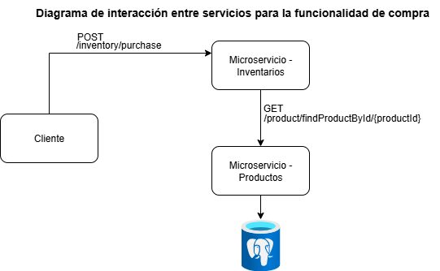

# linkTic
Prueba tecnica desarrollador backend senior

## 🛠 Instrucciones de instalación y ejecución

### 1️⃣ Prerrequisitos
Antes de iniciar, asegúrate de tener instalado en tu equipo:
- [Docker](https://docs.docker.com/get-docker/)
- [Docker Compose](https://docs.docker.com/compose/install/)

### 2️⃣ Clonar el repositorio
- git clone https://github.com/DanielCamachoFonseca/linkTic
- cd nombre-del-repo

### 3️⃣ Construir y levantar los servicios

El proyecto incluye un archivo docker-compose.yml que levanta:

- Base de datos PostgreSQL
- Microservicio de Productos
- Microservicio de Inventarios

Para construir y levantar los contenedores:

- docker-compose up --build

4️⃣ Verificar estado de los servicios

docker ps

5️⃣ Acceder a la documentación Swagger

- Productos: http://localhost:8080/swagger-ui.html

- Inventarios: http://localhost:8081/swagger-ui.html

- Tener en cuenta que la api key que se usa es: LINKTIC_SECRET_123

6️⃣ Detener los servicios
Para detener todos los contenedores:

- docker-compose down

## 🏗 Descripción de la arquitectura

Foot print de arquitectura

La solución implementa una **arquitectura distribuida** basada en **microservicios**, diseñada para gestionar de forma independiente la información de **productos** y **inventarios**.

### Componentes principales
1. **Microservicio de Productos**  
   - Expone endpoints para la creación, consulta, actualización y eliminación de productos.  
   - Proporciona información de productos a otros servicios, como el de Inventarios.  

2. **Microservicio de Inventarios**  
   - Gestiona las existencias de cada producto.  
   - Realiza consultas al microservicio de Productos para validar la existencia y datos del producto antes de registrar o actualizar inventario.  

3. **Base de datos PostgreSQL**  
   - Base de datos relacional compartida por ambos microservicios.  
   - Almacena la información de productos e inventarios en tablas separadas.  

### Comunicación entre microservicios
- Los microservicios se comunican mediante **peticiones HTTP REST** internas en el entorno de Docker.  
- El microservicio de Inventarios consulta el microservicio de Productos para obtener datos antes de realizar operaciones sobre el inventario.  

### Despliegue y orquestación
- Todo el sistema se ejecuta en contenedores Docker gestionados mediante **Docker Compose**.
- Se definen health checks para garantizar que cada servicio esté disponible antes de establecer comunicación.
- Los contenedores están conectados mediante una **red interna de Docker**, permitiendo el consumo de servicios por nombre del contenedor en lugar de `localhost`.

## ⚙️ Decisiones técnicas y justificaciones

Durante el desarrollo del sistema se tomaron diversas decisiones técnicas con el objetivo de optimizar el rendimiento, la mantenibilidad y la claridad de responsabilidades entre microservicios.

### 1. Uso de arquitectura de microservicios
- **Justificación:** La separación en dos microservicios independientes (Productos e Inventarios) permite una mayor escalabilidad y facilita el mantenimiento. Cada microservicio se enfoca en un dominio específico y puede evolucionar de forma independiente.

### 2. Uso de PostgreSQL como base de datos
- **Justificación:** PostgreSQL es una base de datos relacional robusta, de código abierto y con gran soporte para integridad referencial, lo cual es fundamental para manejar la relación entre productos e inventarios.

### 3. Comunicación interna por HTTP REST
- **Justificación:** Se optó por un protocolo estándar ampliamente soportado, lo que permite mantener la simplicidad en la comunicación entre microservicios, además de facilitar pruebas y depuración.

### 4. Implementación del endpoint de compra en el microservicio de Inventarios
- **Decisión:** El endpoint `/inventory/purchase` se implementó en el **microservicio de Inventarios**.
- **Justificación:**
  - El proceso de compra está estrechamente relacionado con la gestión de existencias.
  - El flujo requiere validar la disponibilidad de un producto y posteriormente actualizar el inventario.
  - Desde el punto de vista de responsabilidad única (principio SRP), es más coherente que la lógica de reducción de stock y control de inventarios se gestione en este servicio, consultando la información del producto únicamente para validaciones.
  - Esto evita que el microservicio de Productos tenga que manejar lógica de inventarios, manteniendo una clara separación de responsabilidades.

### 5. Uso de Docker y Docker Compose
- **Justificación:** Facilita el despliegue y configuración del entorno de desarrollo, asegurando que todos los servicios se ejecuten con las dependencias correctas y en redes internas seguras.

## 🏗 Diagrama de interacción entre servicios

## ↪️ Explicación del Flujo de Compra Implementado

El flujo de compra se implementó en el microservicio **Inventarios**, ya que este es el encargado de manejar la gestión de stock y disponibilidad de productos.  
El proceso sigue los siguientes pasos:

1. **Recepción de la solicitud de compra**  
   El cliente envía una petición `POST` al endpoint `/inventory/purchase` del microservicio Inventarios, especificando el ID del producto y la cantidad a comprar.

2. **Consulta al microservicio Productos**  
   Inventarios realiza una solicitud HTTP al endpoint `/product/findProductById/{id}` del microservicio Productos para obtener la información del producto solicitado, incluyendo precio y stock disponible.

3. **Validación de disponibilidad**  
   - Si el producto no existe, se retorna un código **400**.  
   - Si el producto existe pero la cantidad solicitada excede el stock disponible, se retorna un código **400** indicando la indisponibilidad.

4. **Actualización del stock**  
   Si la validación es exitosa, Inventarios envía una actualización a la base de datos para reducir el stock del producto en la cantidad comprada.

5. **Confirmación de la compra**  
   Inventarios retorna un código **200 OK** junto con un mensaje de confirmación y los detalles de la compra.

Este diseño asegura que:
- **Inventarios** centraliza la lógica de compra.
- **Productos** mantiene el control de la información de los productos
- Se preserva la coherencia de datos mediante comunicación síncrona entre microservicios.

## 💻 Documentación sobre el uso de herramientas de IA en el desarrollo

Durante el desarrollo del proyecto se emplearon herramientas de **Inteligencia Artificial (IA)** para acelerar tareas de análisis, generación de código y documentación.  
A continuación, se detallan las herramientas utilizadas, las tareas específicas en las que se aplicaron y los mecanismos de verificación de calidad:

### Herramientas Utilizadas
- **ChatGPT (OpenAI GPT-5)**: Asistente de desarrollo para consultas técnicas, generación de código base, documentación y optimización de pruebas unitarias e integración.

### Tareas Específicas
1. **Documentación técnica**  
   - Redacción del presente `README.md`.
   - Explicaciones de flujo de compra y justificación de decisiones técnicas.

2. **Optimización de pruebas**  
   - Propuestas de escenarios de testing para validar comunicación entre microservicios y manejo de errores.

### Verificación de Calidad del Código Generado
- **Pruebas unitarias y de integración**:  
  Se ejecutaron test automáticos para confirmar que el comportamiento fuera el esperado.
- **Validación en entorno local**:  
  El proyecto se corrió en un ambiente local con PostgreSQL para verificar funcionalidad completa antes de despliegues.

El uso de IA permitió **reducir tiempos de desarrollo**, mejorar la calidad de la documentación y garantizar un flujo de trabajo más ágil, manteniendo siempre la validación humana como paso final antes de cualquier entrega.

✍ Autor: Daniel Camacho Fonseca
📅 Fecha: 13 Agosto 2025

